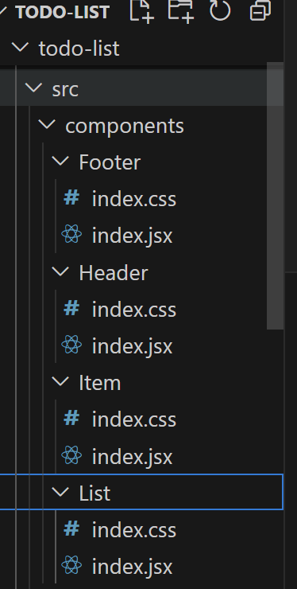
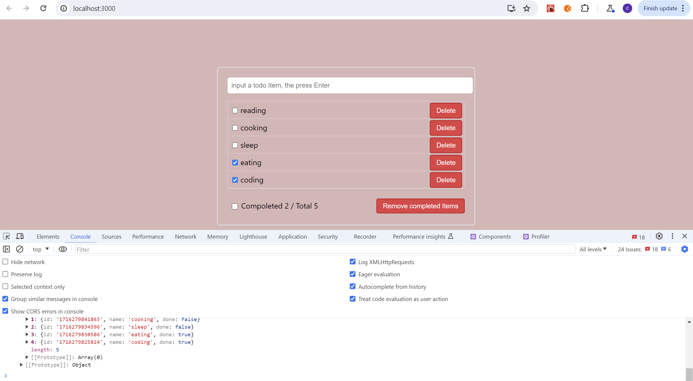

# create app

`npx create-react-app `

# create componets


# layout


# interaction 
```
// insert a new todo to todos ,the function will pass to Component Header by props

 addTodo = (todoObj)=>{
    const {todos} = this.state
    const newTodos = [todoObj,...todos]
    this.setState({todos:newTodos})
    this.saveData(newTodos)

  }
  // delete a todo from todos,The function will pass to Component Item through Component List by props
deleteTodo = (id)=>{
    const {todos} = this.state
    const newTodos = todos.filter(function(todo){
      // console.log(todo.id,id)
      return todo.id !== id

    })
    this.setState({todos:newTodos})
}
// mart tasks as completed or not, The function will pass to Component Item through Component List by props
martTOdo = (id) => {
  
  const {todos} = this.state
  const newTodos = todos.map((todo)=>{
      // console.log(id,todo.id)
      // console.log(todo.done)
      // todo.id === id ? todo.done = !todo.done : todo.done = todo.done
      if (todo.id === id) todo.done = !todo.done
      // console.log(todo.done)
      return todo
  })
  // console.log(newTodos)
  this.setState({todos:newTodos})
}

//  mart all tasks as completed or not, The function will pass to Component Footer by props
markTodos = (isMarkAll) => {
  const {todos} = this.state
  const newTodos = todos.map((todo) => {
    todo.done = isMarkAll
    return todo

  })
  console.log(newTodos)
  this.setState({todos:newTodos})

}

removeCompleteds = () => {
  const {todos} = this.state
  const newTodos = todos.filter(function(todo){
    return todo.done === false
  })

  this.setState({todos:newTodos})

}

  render() {
    console.log(this.state)
    const {todos} = this.state
    return (
      <div className='todo-container'>
        <div className="todo-wrap">
            <Header addTodo={this.addTodo} />
            <List todos={todos} deleteTodo={this.deleteTodo} markTodo={this.martTOdo} />
            <Footer todos={todos} markTodos={this.markTodos} removeCompleteds={this.removeCompleteds} />
        </div>

      </div>
    )
  }
```

# localStorage(read and save)

```

//  when you visit the page first time, localDtorage.getItem('todos') will be null. todos.map() will be a Error . so initialize the state by the following codes when localDtorage.getItem('todos') will be null
  state = JSON.parse(localStorage.getItem('todos')) ? 
  {todos:JSON.parse(localStorage.getItem('todos'))} : 
  {todos:[
    {id:'1',name:'coding',done:true},
    {id:'2',name:'eating',done:true},
    {id:'3',name:'sleeping',done:false}
]}

// save data to local file
  saveData = (todos) =>{
    // const jsonPath = './state.json'
    // const jsonData = JSON.stringify(todos)
    localStorage.setItem('todos',JSON.stringify(todos))
  }

// save data to local storage after update todos
  componentDidUpdate(){
    this.saveData(this.state.todos)
    // localStorage.removeItem('todos');
    // console.log('componentDidUpdate')
  }
  
```

# Getting Started with Create React App

This project was bootstrapped with [Create React App](https://github.com/facebook/create-react-app).

## Available Scripts

In the project directory, you can run:

### `npm start`

Runs the app in the development mode.\
Open [http://localhost:3000](http://localhost:3000) to view it in your browser.

The page will reload when you make changes.\
You may also see any lint errors in the console.

### `npm test`

Launches the test runner in the interactive watch mode.\
See the section about [running tests](https://facebook.github.io/create-react-app/docs/running-tests) for more information.

### `npm run build`

Builds the app for production to the `build` folder.\
It correctly bundles React in production mode and optimizes the build for the best performance.

The build is minified and the filenames include the hashes.\
Your app is ready to be deployed!

See the section about [deployment](https://facebook.github.io/create-react-app/docs/deployment) for more information.

### `npm run eject`

**Note: this is a one-way operation. Once you `eject`, you can't go back!**

If you aren't satisfied with the build tool and configuration choices, you can `eject` at any time. This command will remove the single build dependency from your project.

Instead, it will copy all the configuration files and the transitive dependencies (webpack, Babel, ESLint, etc) right into your project so you have full control over them. All of the commands except `eject` will still work, but they will point to the copied scripts so you can tweak them. At this point you're on your own.

You don't have to ever use `eject`. The curated feature set is suitable for small and middle deployments, and you shouldn't feel obligated to use this feature. However we understand that this tool wouldn't be useful if you couldn't customize it when you are ready for it.

## Learn More

You can learn more in the [Create React App documentation](https://facebook.github.io/create-react-app/docs/getting-started).

To learn React, check out the [React documentation](https://reactjs.org/).

### Code Splitting

This section has moved here: [https://facebook.github.io/create-react-app/docs/code-splitting](https://facebook.github.io/create-react-app/docs/code-splitting)

### Analyzing the Bundle Size

This section has moved here: [https://facebook.github.io/create-react-app/docs/analyzing-the-bundle-size](https://facebook.github.io/create-react-app/docs/analyzing-the-bundle-size)

### Making a Progressive Web App

This section has moved here: [https://facebook.github.io/create-react-app/docs/making-a-progressive-web-app](https://facebook.github.io/create-react-app/docs/making-a-progressive-web-app)

### Advanced Configuration

This section has moved here: [https://facebook.github.io/create-react-app/docs/advanced-configuration](https://facebook.github.io/create-react-app/docs/advanced-configuration)

### Deployment

This section has moved here: [https://facebook.github.io/create-react-app/docs/deployment](https://facebook.github.io/create-react-app/docs/deployment)

### `npm run build` fails to minify

This section has moved here: [https://facebook.github.io/create-react-app/docs/troubleshooting#npm-run-build-fails-to-minify](https://facebook.github.io/create-react-app/docs/troubleshooting#npm-run-build-fails-to-minify)
